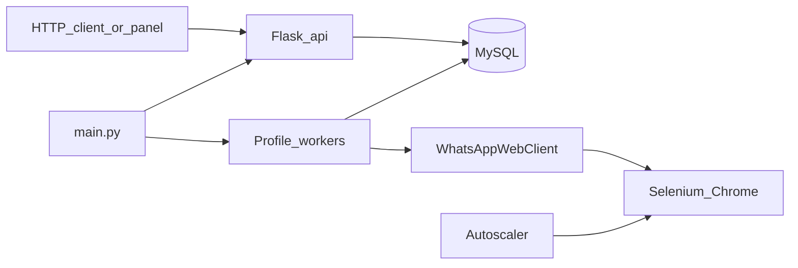

# WPBot

**Queue WhatsApp messages through WhatsApp Web with a small REST API.**

[](https://www.python.org/)
[](https://flask.palletsprojects.com/)
[](https://www.selenium.dev/)
[](LICENSE)
[](https://github.com/dogukannparlak/whatsappbot)

---

## About

I built **WPBot** as a personal side project to explore browser automation, job queues, and multi-session scaling — without leaning on the official WhatsApp Business API. It drives **WhatsApp Web** in Chrome (Selenium), exposes a **Flask REST API**, and persists work in **MySQL** so sends survive restarts, pauses, and retries.

This is **not** a production messaging platform or a Meta-approved integration. It is a learning-friendly tool for small, responsible automations on your own account.

---

## Features

- **Job queue** — async sends with `request_id`, status timeline, and per-target results
- **Control endpoints** — pause, resume, cancel, retry, bulk `/recover`
- **Multi-profile Chrome** — separate `Browser/profile_XX` sessions (QR cached per profile)
- **Autoscaler** — spawns extra profiles when pending targets exceed ready capacity
- **Self-healing** — relaunches Chrome if the window/session dies; startup recovery for stuck jobs
- **Web UI** — control panel at `/` and live API docs at `/docs` (with `/metrics`)

---

## Disclaimer

- Automating WhatsApp Web may violate [WhatsApp's Terms of Service](https://www.whatsapp.com/legal/terms-of-service). Use at your own risk.
- Do **not** use this for spam, bulk unsolicited messaging, or anything that harms recipients.
- The `Browser/` directory holds **logged-in session data** (cookies, local storage). Treat it like a password — never commit it (already in `.gitignore`).
- You are responsible for compliance with local laws and platform rules.

---

## Prerequisites

| Requirement | Notes |
|-------------|--------|
| **Python 3.10+** | Tested with a standard venv workflow |
| **Google Chrome** | Selenium 4.6+ manages ChromeDriver via Selenium Manager |
| **MySQL 8+** | Jobs, targets, events, and contact groups |
| **OS** | Windows or Linux; headless mode available via `CHROME_HEADLESS=true` |

---

## Quick start

```bash
git clone https://github.com/dogukannparlak/whatsappbot.git
cd whatsappbot

python -m venv .venv
# Windows
.venv\Scripts\activate
# Linux/macOS
# source .venv/bin/activate

pip install -r requirements.txt

cp .env.example .env
# Edit .env — set all DB_* values and optional tuning
```

Create the MySQL database, then start the app (tables are created on first run via `init_db()`):

```bash
python main.py
```

1. Chrome opens for `profile_01` (and more if `INITIAL_PROFILES` > 1).
2. Scan the **QR code** in WhatsApp Web if this profile is new.
3. The control panel opens at `http://127.0.0.1:5000/` (or your `API_HOST` / `API_PORT`).
4. Interactive API reference: `http://127.0.0.1:5000/docs`

---

## Configuration

Copy [`.env.example`](.env.example) to `.env`. Main variables:

| Variable | Default | Description |
|----------|---------|-------------|
| `API_HOST` | `127.0.0.1` | Flask bind address |
| `API_PORT` | `5000` | Flask port |
| `CHROME_HEADLESS` | `false` | Run Chrome without UI |
| `BROWSER_ROOT_DIR` | `Browser` | Chrome user-data profiles |
| `WHATSAPP_URL` | `https://web.whatsapp.com/` | WhatsApp Web URL |
| `LOGIN_TIMEOUT_SECONDS` | `120` | QR / login wait |
| `INITIAL_PROFILES` | `1` | Profiles at startup |
| `TASKS_PER_PROFILE` | `10` | Pending targets per ready profile before scale-up |
| `SCALE_INTERVAL_SECONDS` | `5` | Autoscaler poll interval |
| `PROFILE_START_DELAY_SECONDS` | `4` | Delay between spawning profiles |
| `DB_HOSTNAME` | — | MySQL host (**required**) |
| `DB_NAME` | — | Database name (**required**) |
| `DB_USERNAME` | — | MySQL user (**required**) |
| `DB_PASSWORD` | — | MySQL password (**required**) |
| `DB_PORT` | `3306` | MySQL port (**required**) |
| `DB_CHARSET` | `utf8mb4` | Connection charset |
| `APP_TIMEZONE` | `Europe/Istanbul` | Status API timestamps |
| `LOG_DIR` | `logs` | Log files directory |
| `LOG_LEVEL` | `INFO` | Logging level |

---

## Group messaging

Groups are resolved from the `contacts` table (`group_name` → phone list). Example:

```sql
INSERT INTO contacts (name, phone, group_name) VALUES
  ('Alice', '+905551111111', 'Friends'),
  ('Bob',   '+905552222222', 'Friends');
```

Then:

```http
GET /send/Friends/Hello%20everyone
```

If the group name is unknown, the API returns `404` with `{"error": "group_not_found"}`.

---

## API overview

| Method | Path | Description |
|--------|------|-------------|
| `GET` | `/health` | Liveness check |
| `GET` | `/ready` | `wa_ready` — any profile logged in |
| `GET` | `/metrics` | Live queue and profile stats (JSON) |
| `GET` | `/send/<target>/<message>` | Queue a send (phone, multi-phone, or group name) |
| `GET` | `/status/<request_id>` | Job status, targets, timeline |
| `GET` | `/pause/<request_id>` | Pause job |
| `GET` | `/resume/<request_id>` | Resume job |
| `GET` | `/cancel/<request_id>` | Cancel job |
| `GET` | `/retry/<request_id>` | Re-queue failed/canceled targets |
| `GET` | `/recover` | Bulk reset paused/failed jobs |
| `GET` | `/`, `/panel` | Web control panel |
| `GET` | `/docs` | Interactive API documentation |

**Send examples**

```http
# Single phone
GET /send/+90555550123/Hello

# Multiple phones (comma-separated)
GET /send/905311111111,905322222222/Hello%20both

# Different messages per phone (comma-separated messages)
GET /send/905311111111,905322222222/msg1,msg2

# Group by name (from contacts table)
GET /send/Friends/Team%20update
```

Successful queue responses return `202 Accepted` with `request_id` and `status_url`.

Full examples and response shapes: open **`/docs`** in the browser after starting the server.

---

## Architecture



**Flow**

1. HTTP client or web panel calls `/send` → job + targets written to MySQL (`queued`).
2. Each **profile worker** (bound to one Chrome session) picks the next job when `ready`.
3. `WhatsAppWebClient` opens a chat via WhatsApp Web deep-link and sends the text.
4. **Autoscaler** adds `profile_N+1` when `pending_targets > ready_profiles × TASKS_PER_PROFILE`.
5. On process restart, `running` jobs are reset to `queued` so work continues safely.

---

## Project structure

```
whatsappbot/
├── main.py           # Entry: API thread, profiles, workers, autoscaler
├── api.py            # Flask routes and serialization
├── whatsapp.py       # Selenium WhatsApp Web client
├── db.py             # SQLAlchemy models and helpers
├── config.py         # Environment configuration
├── drivers.py        # Chrome WebDriver factory
├── logger_setup.py   # Colored logging
├── index.html        # Web control panel
├── static/           # wpbot.css, wpbot.js (docs UI)
├── requirements.txt
├── .env.example
└── Browser/          # Chrome profiles (gitignored, created at runtime)
```

---

## Troubleshooting

| Symptom | What to try |
|---------|-------------|
| App exits immediately on start | Fill all `DB_*` fields in `.env`; check MySQL is reachable |
| `wa_ready: false` forever | Scan QR in the Chrome window; increase `LOGIN_TIMEOUT_SECONDS` |
| Chrome profile locked | Close other Chrome instances using the same `BROWSER_ROOT_DIR` path |
| `group_not_found` | Add rows to `contacts` with matching `group_name` |
| Partial sends / `partial_failure` | Use `/retry/<request_id>` or `/recover`; check profile stayed logged in |
| Headless login issues | Run with `CHROME_HEADLESS=false` first to complete QR, then try headless |

Logs are written under `LOG_DIR` (default `logs/`).

---

## Contributing

Contributions are welcome — issues, docs fixes, and focused PRs. Please read [CONTRIBUTING.md](CONTRIBUTING.md) first.

---

## License

This project is licensed under the [MIT License](LICENSE).

---

## Author

**Dogukan Parlak** — [@dogukannparlak](https://github.com/dogukannparlak)

If this project helped you learn something, a star on GitHub is always appreciated.
